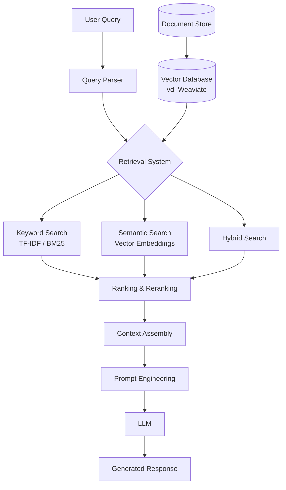

# 🧠 RAG - Retrieval Augmented Generation

> Nguồn: [DeepLearning.AI - Retrieval Augmented Generation (RAG) Course](https://www.deeplearning.ai/courses/retrieval-augmented-generation-rag/)
> Giảng viên: **Zain Hasan** - AI Engineer & Educator (~10 năm kinh nghiệm)

---

## 1. RAG là gì?

**RAG (Retrieval Augmented Generation)** là một kỹ thuật giúp các **Mô hình Ngôn ngữ Lớn (LLM)** tạo ra các câu trả lời **chính xác và hữu ích hơn** bằng cách **truy xuất thông tin liên quan** từ các nguồn dữ liệu bên ngoài mà LLM chưa được huấn luyện.

### Tại sao cần RAG?

| Vấn đề của LLM thuần túy | RAG giải quyết như thế nào |
|---|---|
| LLM chỉ biết dữ liệu trong tập huấn luyện | RAG kết nối LLM với dữ liệu **mới, riêng tư, chuyên ngành** |
| LLM thường "ảo giác" (hallucinate) - bịa đặt thông tin | RAG **neo câu trả lời vào dữ liệu thực tế** được truy xuất |
| LLM không có kiến thức cập nhật | RAG truy xuất dữ liệu **real-time** hoặc cập nhật mới nhất |
| LLM không truy cập được dữ liệu nội bộ doanh nghiệp | RAG cho phép LLM đọc **tài liệu nội bộ, cơ sở tri thức riêng** |

### Cách RAG hoạt động (đơn giản)

```
┌─────────────┐    ┌──────────────────┐    ┌─────────────┐
│  Câu hỏi    │───▶│  Retriever       │───▶│  Kho dữ liệu│
│  người dùng │    │  (Truy xuất)     │    │  (Knowledge │
│             │    │                  │◀───│   Base)      │
└─────────────┘    └────────┬─────────┘    └─────────────┘
                            │
                   Thông tin liên quan
                            │
                            ▼
                   ┌──────────────────┐
                   │  Prompt +        │
                   │  Context từ      │───▶  Câu trả lời
                   │  retriever       │      chính xác
                   │  → gửi vào LLM  │
                   └──────────────────┘
```

**Quy trình 3 bước:**
1. **Truy xuất (Retrieve):** Tìm kiếm và lấy các tài liệu/thông tin liên quan từ knowledge base
2. **Tăng cường (Augment):** Ghép thông tin truy xuất được vào prompt gửi cho LLM
3. **Sinh (Generate):** LLM tạo câu trả lời dựa trên prompt đã được tăng cường bởi ngữ cảnh thực tế

---

## 2. Kiến trúc RAG

### 2.1. Thành phần cốt lõi



### 2.2. Các kỹ thuật tìm kiếm (Information Retrieval)

| Kỹ thuật | Mô tả | Ưu điểm | Nhược điểm |
|---|---|---|---|
| **Keyword Search (BM25)** | Tìm kiếm dựa trên từ khóa, tần suất xuất hiện | Nhanh, chính xác với exact match | Không hiểu ngữ nghĩa |
| **Semantic Search** | Sử dụng vector embeddings để tìm kiếm theo nghĩa | Hiểu ngữ nghĩa, tìm đồng nghĩa | Cần tính toán embedding |
| **Hybrid Search** | Kết hợp keyword + semantic search | Tận dụng ưu điểm cả hai | Phức tạp hơn để tune |
| **Metadata Filtering** | Lọc theo metadata (ngày, tác giả, loại,...) | Thu hẹp phạm vi tìm kiếm | Cần metadata tốt |

### 2.3. Vector Database & Embedding

- **Vector Embeddings**: Chuyển đổi văn bản thành vector số học trong không gian nhiều chiều, giúp so sánh "ý nghĩa" giữa các đoạn văn bản
- **ANN Algorithms** (Approximate Nearest Neighbor): Thuật toán tìm kiếm nhanh các vector gần nhất
- **Vector Database** (vd: **Weaviate**): Cơ sở dữ liệu chuyên dụng lưu trữ và truy vấn vector embeddings hiệu quả

### 2.4. Chunking (Chia nhỏ tài liệu)

Tài liệu lớn cần được chia nhỏ thành các "chunk" phù hợp để:
- Phù hợp với context window của LLM
- Tăng độ chính xác của retrieval
- Cân bằng giữa đủ chi tiết và không quá dài

### 2.5. Reranking

- **Cross-encoders**: Mô hình đánh giá lại mức độ liên quan giữa query và mỗi document
- **ColBERT**: Mô hình reranking hiệu quả
- **Reciprocal Rank Fusion (RRF)**: Kết hợp kết quả từ nhiều retriever khác nhau

---

## 3. LLM & Sinh văn bản trong RAG

### 3.1. Các yếu tố quan trọng

| Yếu tố | Chi tiết |
|---|---|
| **Transformer Architecture** | Kiến trúc nền tảng của các LLM hiện đại |
| **LLM Sampling Strategies** | Temperature, top-k, top-p - kiểm soát tính ngẫu nhiên |
| **Prompt Engineering** | Thiết kế prompt tối ưu để tận dụng context retrieved |
| **Chọn LLM phù hợp** | So sánh các LLM (GPT, Claude, open-source...) cho use case |
| **Xử lý hallucinations** | Kỹ thuật giảm thiểu "ảo giác" trong câu trả lời |

### 3.2. RAG vs Fine-tuning

| Tiêu chí | RAG | Fine-tuning |
|---|---|---|
| **Dữ liệu mới** | ✅ Cập nhật realtime | ❌ Cần train lại |
| **Chi phí** | 💰 Thấp hơn (không cần GPU) | 💰💰 Cần GPU để train |
| **Độ chính xác** | ✅ Cao (có nguồn trích dẫn) | ⚠️ Có thể hallucinate |
| **Chuyên ngành sâu** | ⚠️ Phụ thuộc vào knowledge base | ✅ Model "hiểu" domain |
| **Thời gian triển khai** | ✅ Nhanh | ❌ Cần thời gian train |
| **Tùy biến phong cách** | ❌ Khó | ✅ Dễ dàng |

> **Kết luận:** RAG tốt cho việc truy cập dữ liệu mới/riêng tư. Fine-tuning tốt cho việc thay đổi hành vi/phong cách của model. Có thể **kết hợp cả hai**.

---

## 4. RAG trong Production

### 4.1. Thách thức khi đưa RAG lên production

```
┌────────────────────────────────────────────────────────┐
│                  RAG Production Challenges              │
├───────────────┬────────────────┬───────────────────────┤
│  Performance  │   Reliability  │      Operations       │
├───────────────┼────────────────┼───────────────────────┤
│ • Latency     │ • Hallucinations│ • Logging            │
│ • Cost        │ • Data freshness│ • Monitoring         │
│ • Scalability │ • Security      │ • Observability      │
│ • Quantization│ • Privacy       │ • Tracing            │
└───────────────┴────────────────┴───────────────────────┘
```

### 4.2. Đánh giá RAG System

- **Retrieval Metrics**: Đo lường chất lượng truy xuất (Precision, Recall, MRR, NDCG)
- **Generation Evaluation**: Đánh giá chất lượng câu trả lời (faithfulness, relevance, completeness)
- **Customized Evaluation**: Xây dựng metrics riêng cho use case cụ thể
- **Tools**: Sử dụng **Phoenix (Arize)** để monitoring & tracing

### 4.3. Cân bằng tradeoffs

| Tradeoff | Giải thích |
|---|---|
| **Latency vs Quality** | Reranking tăng chất lượng nhưng tăng latency |
| **Cost vs Quality** | Sử dụng model lớn hơn = tốt hơn nhưng đắt hơn |
| **Context Size** | Nhiều context hơn = nhiều thông tin hơn nhưng chậm & đắt hơn |
| **Quantization** | Giảm kích thước model = nhanh & rẻ hơn nhưng có thể giảm chất lượng |

### 4.4. Bảo mật & Multimodal

- **Security**: Bảo vệ dữ liệu nhạy cảm, kiểm soát truy cập
- **Multimodal RAG**: Mở rộng RAG không chỉ cho text mà còn cho hình ảnh, video, audio

---

## 5. Agentic RAG

**Agentic RAG** là bước tiến hóa tiếp theo, kết hợp RAG với khả năng **agentic** (tự chủ):
- LLM tự quyết định **khi nào** cần truy xuất thông tin
- Tự chọn **nguồn dữ liệu** phù hợp
- Có thể thực hiện **nhiều vòng truy xuất** để thu thập đủ thông tin
- Tự đánh giá và cải thiện câu trả lời

---

## 6. Công nghệ & Công cụ được sử dụng trong khóa học

| Công cụ | Vai trò |
|---|---|
| **Python** | Ngôn ngữ lập trình chính |
| **Weaviate** | Vector Database |
| **Phoenix (Arize)** | Monitoring, tracing, evaluation |
| **Together AI** | Hosting open-source LLMs |
| **BM25** | Keyword search |
| **Cross-encoders / ColBERT** | Reranking |

---

## 7. Syllabus chi tiết (5 Modules)

### Module 1: Tổng quan RAG
- Giới thiệu RAG, ứng dụng RAG
- Tổng quan kiến trúc RAG
- Giới thiệu LLMs, LLM API calls
- Cơ bản Python, Information Retrieval

### Module 2: Nền tảng tìm kiếm & truy xuất thông tin
- Kiến trúc Retriever
- Metadata filtering
- Keyword search (TF-IDF, BM25)
- Semantic search, Vector embeddings
- Hybrid search
- Đánh giá retrieval, retrieval metrics

### Module 3: Truy xuất thông tin với Vector Databases
- Thuật toán ANN (Approximate Nearest Neighbor)
- Vector databases & Weaviate API
- Chunking strategies
- Query parsing
- Cross-encoders, ColBERT, Reranking

### Module 4: LLMs & Sinh văn bản
- Kiến trúc Transformer
- LLM sampling strategies
- Khám phá khả năng LLM
- Chọn LLM phù hợp
- Prompt engineering
- Xử lý hallucinations
- Đánh giá hiệu suất LLM
- Agentic RAG
- RAG vs Fine-tuning

### Module 5: RAG Systems trong Production
- Thách thức production
- Chiến lược đánh giá RAG
- Logging, monitoring, observability
- Tracing RAG system
- Custom evaluation
- Quantization
- Cost vs quality, Latency vs quality
- Security
- Multimodal RAG

---

## 8. Tóm tắt nhanh

> **RAG = Retrieval + Augmentation + Generation**
> 
> Thay vì chỉ dựa vào kiến thức sẵn có, LLM **tìm kiếm thông tin liên quan** từ nguồn bên ngoài → **ghép vào prompt** → **sinh ra câu trả lời chính xác hơn**.
> 
> Đây là kỹ thuật **quan trọng nhất** hiện nay để xây dựng ứng dụng AI đáng tin cậy trong thực tế.
